# Clash Subscriber

Clash Subscriber 是一个面向 Clash/Mihomo 的订阅管理与配置构建中心。它把多个订阅源、节点标签、规则组、脚本处理、配置组合、构建流水线和 Mihomo 实例推送集中到一个 Web 管理台中，适合把分散的订阅与自定义规则整理成稳定可复用的配置。

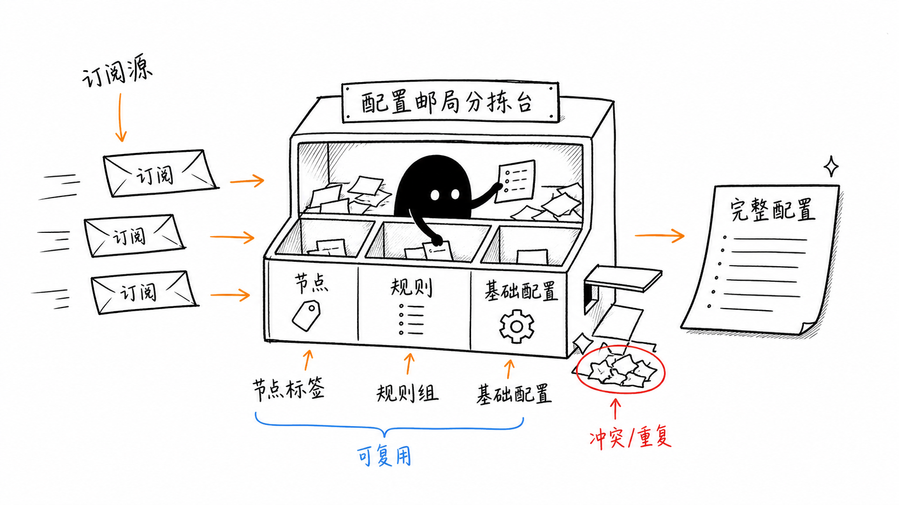

## 项目功能特性

- 多订阅源管理：维护多个 Clash/Mihomo 订阅链接，支持 User-Agent 和自定义请求头，订阅 URL 在界面中默认脱敏展示。
- 订阅详情解析：查看订阅的代理节点、代理组、规则列表和代理组关系，并可查看原始 YAML。
- 节点标签管理：用关键词规则给节点归类，支持优先级、导入和导出。
- 规则组管理：从订阅提取规则组，或手动维护可复用规则组，并通过代理对象占位符适配不同配置。
- 配置组合：把订阅、代理组、规则组、基础 Clash 配置和访问认证组合成可直接订阅的 YAML。
- 脚本处理：在线编辑 JavaScript 脚本，支持基于订阅源试运行并对比输入、输出配置摘要。
- 构建流水线：支持订阅源模式和配置组合模式，可串联脚本、目标 Mihomo 实例、Cron 定时和手动构建。
- 构建记录：保存每次构建的步骤、状态、耗时、错误信息和中间配置快照。
- Mihomo 实例管理：维护多个实例的 External Controller 地址和 Secret，支持健康检查、配置推送和转发路径查询。
- 管理员登录：首次访问初始化管理员，后续需要登录才能进入管理台。

## 快速开始

### Docker 部署

```bash
docker run -d \
  --name clash-subscriber \
  -p 31192:31192 \
  -v ./data:/app/data \
  -e TZ=Asia/Shanghai \
  --restart unless-stopped \
  kael2018/clash-subscriber:latest
```

也可以使用仓库内的 `docker-compose.yml`：

```bash
git clone https://github.com/kael-aiur/clash-subscriber.git
cd clash-subscriber
docker-compose up -d
```

启动后访问：

```text
http://localhost:31192
```

首次访问会进入“创建管理员”页面。创建完成后使用该账号登录管理台。

### 手动部署

需要 Java 21 和 Maven：

```bash
git clone https://github.com/kael-aiur/clash-subscriber.git
cd clash-subscriber
mvn clean package -DskipTests
java -jar module-web/target/*.jar
```

默认端口是 `31192`。可以通过环境变量或 JVM 参数调整：

```bash
SERVER_PORT=9090 docker-compose up -d
java -Dserver.port=9090 -jar module-web/target/*.jar
```

### 数据目录

默认数据目录是 `data/`，Docker 部署时建议挂载到宿主机。主要子目录如下：

| 目录 | 内容 |
| --- | --- |
| `data/admin/` | 管理员账号 |
| `data/subscriptions/` | 订阅源定义 |
| `data/cache/` | 订阅拉取缓存 |
| `data/node-tags/` | 节点标签 |
| `data/rule-groups/` | 规则组 |
| `data/config-profiles/` | 配置组合 |
| `data/scripts/` | JavaScript 脚本 |
| `data/build-pipelines/` | 构建流水线 |
| `data/build-records/` | 构建记录 |
| `data/mihomo-instances/` | Mihomo 实例 |
| `data/scheduled-tasks/` | 独立定时任务 |

## 使用说明

### 1. 初始化和登录

首次打开应用时创建管理员账号；之后访问任何管理页面都会检查登录状态。右上角显示当前用户，并提供退出登录按钮。

### 2. 管理订阅源

进入“订阅管理”，点击“添加订阅源”，填写名称、订阅 URL、User-Agent 和自定义 Headers。列表中可以执行获取、查看详情、提取规则组、编辑和删除。

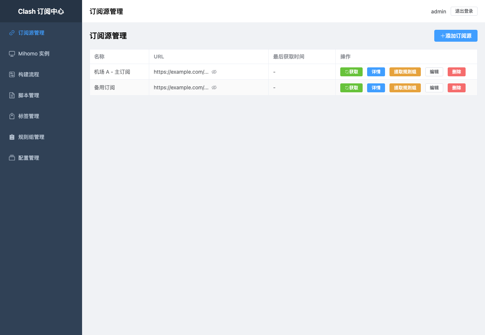

点击“详情”后可以查看订阅解析结果：基本信息、代理节点、节点组、规则和配置关系。配置关系页适合排查代理组之间的引用。

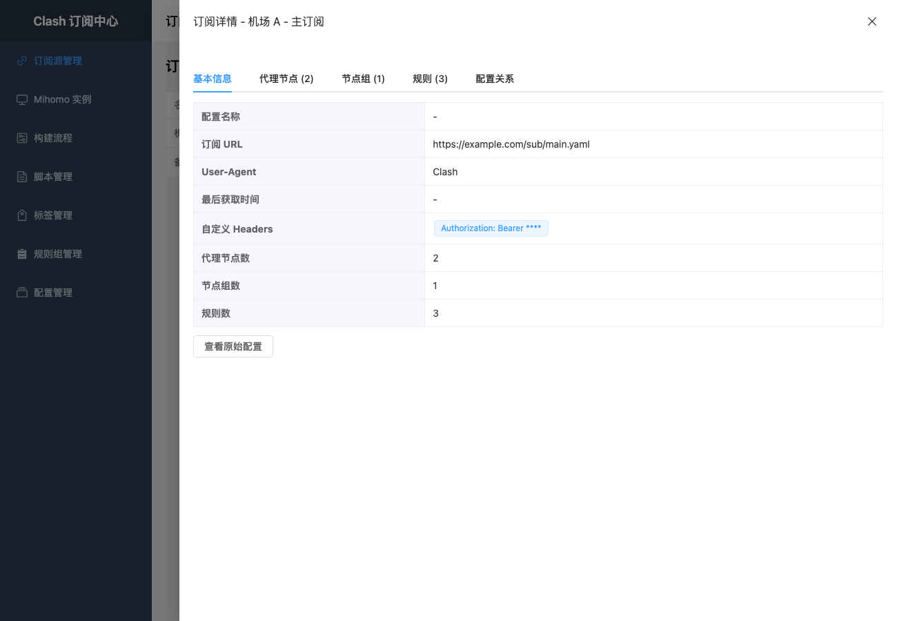

### 3. 维护节点标签

进入“标签管理”，为节点名称配置关键词匹配规则和优先级。配置组合中的代理组可以按关键词选择节点，也可以排除流量、到期时间、高倍率等不希望进入代理组的节点。

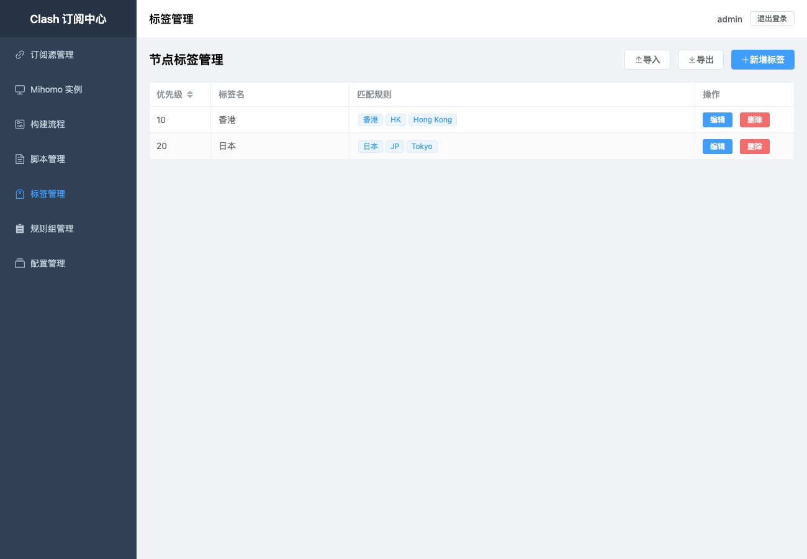

### 4. 管理规则组

进入“规则组管理”，可以手动创建规则组，也可以从订阅详情中提取规则组。规则组详情支持查看、增加、编辑、删除规则，并维护代理对象占位符。

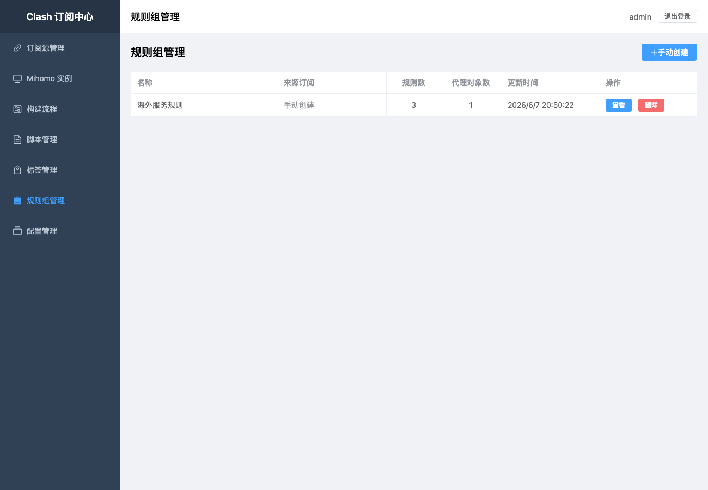

### 5. 创建配置组合

进入“配置管理”，点击“新建配置”。一个配置组合通常包含：

- 订阅源：选择一个或多个节点来源。
- 代理组：定义 `select`、`url-test`、`fallback`、`load-balance` 等代理组。
- 规则组：引用可复用规则组，并把规则组中的代理对象映射到当前配置的代理组。
- 访问认证：为生成的订阅链接设置用户名和密码。
- 基础配置：端口、模式、日志级别、外部控制地址和 Secret。

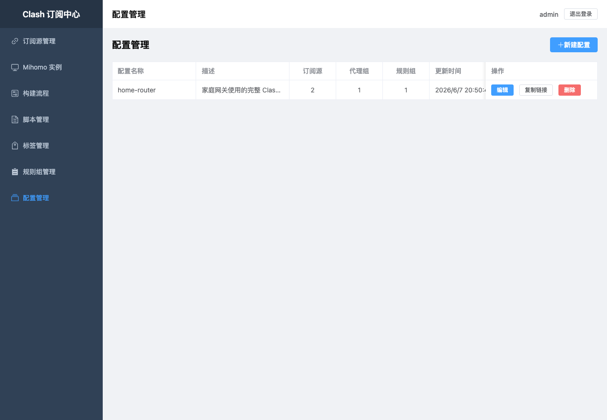

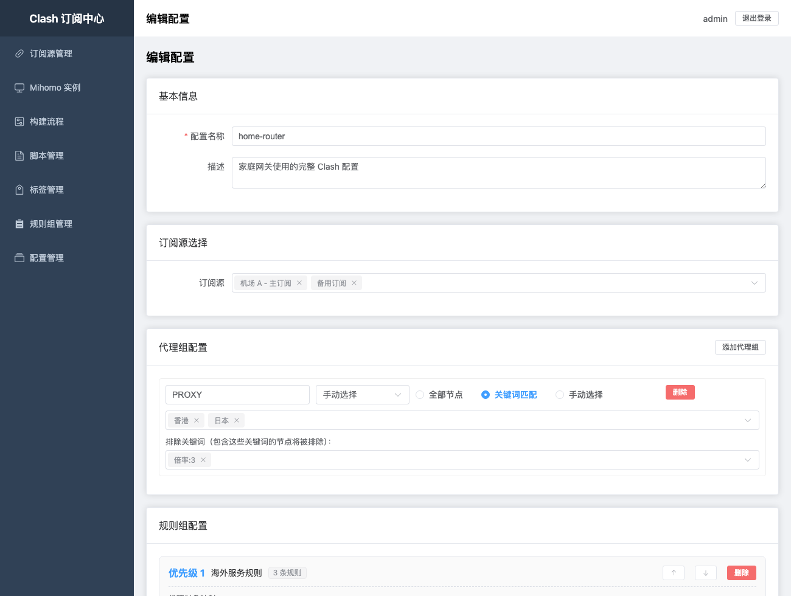

保存后可以在列表中复制订阅链接，客户端通过该链接获取生成后的 Clash YAML。

### 6. 编写和试运行脚本

进入“脚本管理”新增脚本。脚本用于在构建过程中二次处理配置，例如过滤节点、重命名节点、调整规则或补充代理组。编辑器支持全屏 Monaco 编辑，并提供订阅预览和试运行面板。

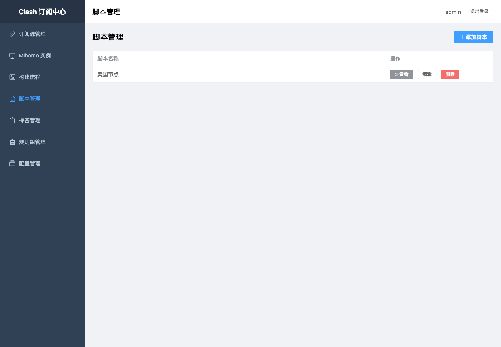

脚本示例：

```javascript
function main(config) {
  config.proxies = (config.proxies || []).filter(p => /US|美国/.test(p.name));
  return config;
}
```

### 7. 配置构建流水线

进入“构建流程”，点击“新建构建流程”。配置类型可选：

- 订阅源模式：选择主订阅和额外订阅，合并后执行脚本和推送。
- 配置组合模式：选择已经维护好的配置组合，生成完整配置后执行脚本和推送。

流水线可绑定脚本、目标实例、Cron 表达式，也可以点击“构建”手动执行。

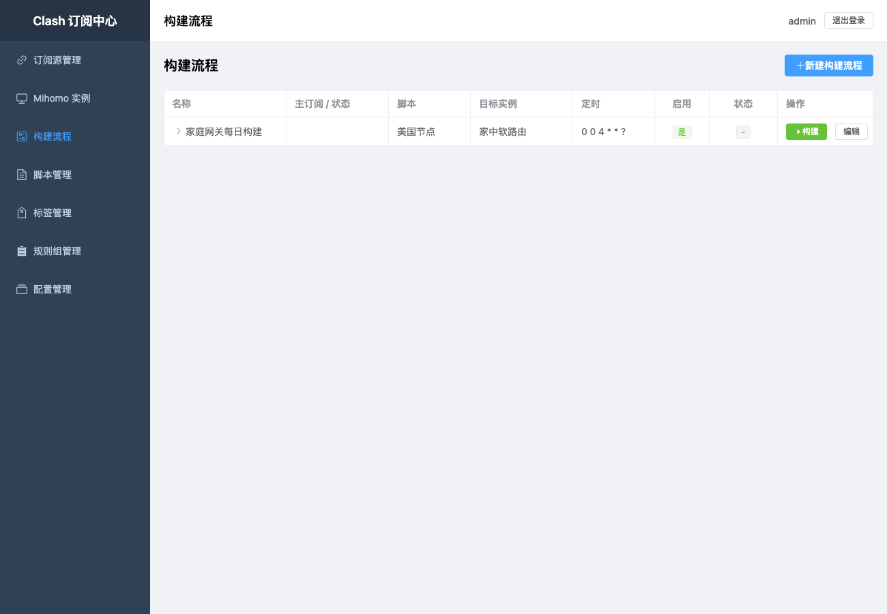

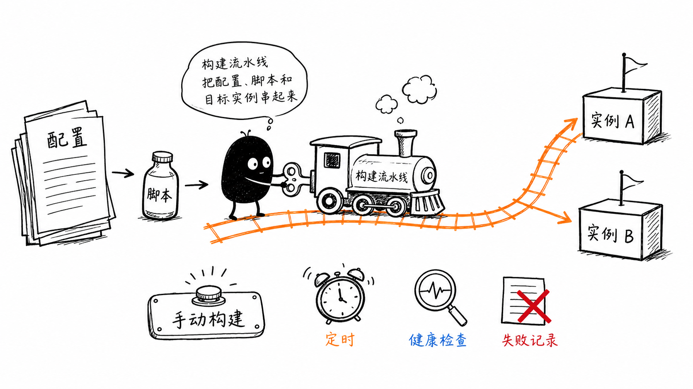

### 8. 管理 Mihomo 实例

进入“Mihomo 实例”，添加实例名称、API 地址和 API 密钥。API 地址应指向 Mihomo External Controller，例如 `http://192.168.1.1:9090`。可以对单个或全部实例执行健康检查，也可以手动推送配置。

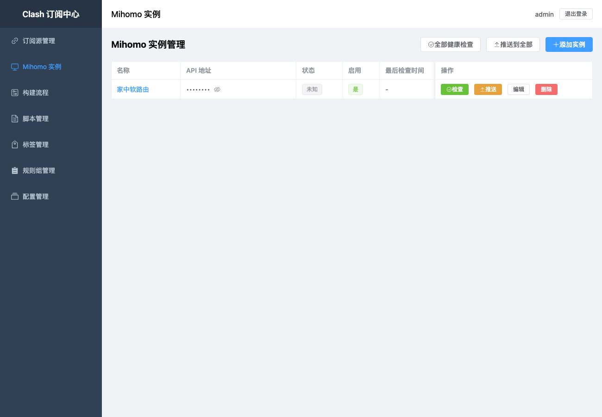

实例详情页包含实例信息、转发规则和推送历史。转发规则页可以输入域名，查看匹配到的规则、策略和转发路径。

### 9. 使用定时任务

进入“定时任务管理”，选择构建流水线、目标实例和 Cron 表达式。任务可启停、编辑、删除，也可以手动触发。

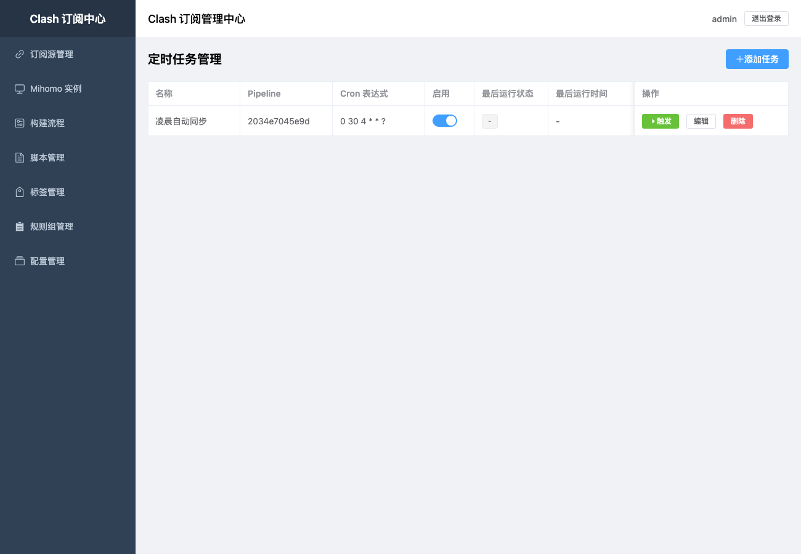

## 功能介绍

### 配置生成链路

配置组合是项目的核心能力。它不会简单拼接订阅文本，而是把订阅解析成节点、代理组和规则，再按用户维护的代理组、规则组、基础配置重新生成 Clash YAML。这样可以把服务商订阅中的可变内容和用户自己的长期配置拆开维护。

### 构建流水线

构建流水线负责把配置来源、脚本处理、目标实例和调度策略串起来。一次构建会形成构建记录，便于回看每一步输入输出和失败原因。

### 脚本引擎

脚本引擎面向高级定制场景。脚本接收解析后的配置对象并返回修改后的配置对象，可以实现规则无法覆盖的逻辑。建议先用“试运行”对比输入输出，再挂载到构建流水线。

### Mihomo 对接

实例管理模块通过 Mihomo External Controller 执行健康检查、配置获取和配置推送。配置推送依赖实例 API 地址和 Secret 正确配置。

### 配置订阅链接

配置组合保存后可以生成可订阅的 YAML 地址。若配置了用户名和密码，客户端需要携带对应认证信息访问该地址。

## 本地开发

后端：

```bash
mvn test
mvn -pl module-web spring-boot:run
```

前端：

```bash
cd module-web/frontend
npm install
npm run dev
```

前端构建产物由 `module-web` 打包进 Spring Boot 静态资源。

## 模块说明

| 模块 | 说明 |
| --- | --- |
| `module-common` | Clash 配置模型、工具和通用异常 |
| `module-subscription` | 订阅源管理、拉取、解析和缓存 |
| `module-processor` | 配置处理器、规则组、配置组合和脚本引擎 |
| `module-mihomo` | Mihomo 实例、健康检查、推送和转发路径 |
| `module-scheduler` | 定时任务调度 |
| `module-pipeline` | 构建流水线和构建记录 |
| `module-web` | REST API、认证和 Vue 前端 |

## 许可证

本项目采用 [Apache License 2.0](LICENSE) 许可证。
